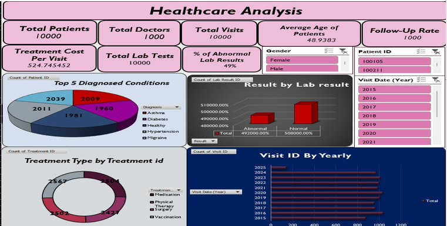

# Healthcare Dashboard Project
This repository contains interactive dashboards built using **Excel, Power BI, and Tableau**. 
The project involves analyzing healthcare patient data to uncover key trends and performance metrics.

## Key Features
- Automated data cleaning using ETL processes
- Visualization of KPIs like treatment costs,Lab Tests and demographics
- Tools: Excel, Power BI, Tableau

# EXCEl DASHBOARD  Screenshots
  

# POWER BI DASHBOARD  Screenshots
 
# POWER BI DASHBOARD  Screenshots
